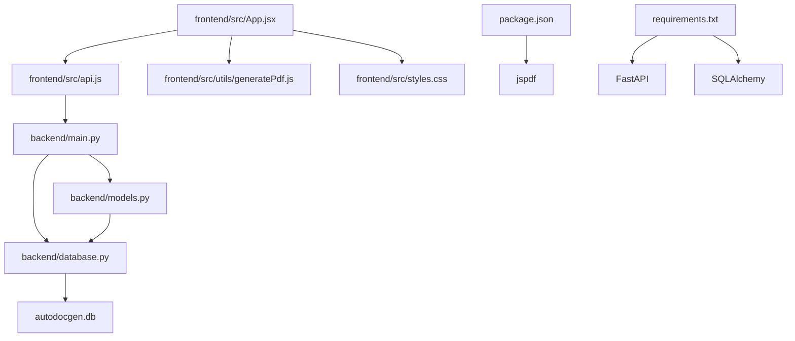

# 📚 AutoDocGen

<div align="center">

**Автоматически сгенерированная документация**

</div>

---

## 📋 Метаданные проекта

| Параметр | Значение |
|----------|----------|
| **Владелец** | `RamzikProger` |
| **Дата анализа** | `2026-06-08 12:20:02` |
| **Коммит** | `fd686c28` |
| **Классов** | `9` |
| **Функций** | `39` |

---


## 🌳 Структура проекта

*Визуальное представление структуры директорий и файлов.*

### Visual Tree

```
AutoDocGen/
│   ├── backend
│   │   ├── backend/__init__.py
│   │   ├── backend/autodocgen.db
│   │   ├── backend/database.py
│   │   ├── backend/main.py
│   │   ├── backend/models.py
│   │   └── backend/requirements.txt
│   ├── docs
│   │   ├── docs/@TZ.md
│   │   ├── docs/api-contract.md
│   │   └── docs/implementation-stages.md
│   ├── frontend
│   │   ├── frontend/public
│   │   │   └── frontend/public/fonts
│   │   │       └── frontend/public/fonts/DejaVu Sans.ttf
│   │   ├── frontend/src
│   │   │   ├── frontend/src/utils
│   │   │   │   └── frontend/src/utils/generatePdf.js
│   │   │   ├── frontend/src/api.js
│   │   │   ├── frontend/src/App.jsx
│   │   │   ├── frontend/src/main.jsx
│   │   │   └── frontend/src/styles.css
│   │   ├── frontend/.env.local
│   │   ├── frontend/index.html
│   │   ├── frontend/package-lock.json
│   │   ├── frontend/package.json
│   │   ├── frontend/postcss.config.js
│   │   └── frontend/tailwind.config.js
│   ├── .cursorrules
│   ├── .gitignore
│   ├── AutoDocGen.pptx
│   ├── package-lock.json
│   ├── package.json
    └── README.md
```

### Directory Structure

# Directory Structure
🔍 Детальный анализ структуры проекта AutoDocGen

## 1. Организация директорий
📁 Основные директории проекта

| Директория | Назначение | Количество файлов | Тип содержимого |
|------------|------------|-------------------|-----------------|
| `AutoDocGen/` | Корневая директория проекта | 9 файлов | Конфигурационные файлы, презентация, документация |
| `backend/` | Серверная часть приложения | - 6 файлов<br>- 1 поддиректория (`__pycache__` не указана, но обычно присутствует) | Python-код, база данных SQLite, зависимости |
| `frontend/` | Клиентская часть приложения | - 8 файлов<br>- 2 поддиректории (`public/`, `src/`) | React-приложение, конфигурации, стили, шрифты |
| `docs/` | Документация проекта | 3 файла | Техническое задание, API-контракт, этапы реализации |
| `frontend/public/` | Статические ресурсы фронтенда | 1 файл + 1 поддиректория | Шрифты и статические assets |
| `frontend/src/` | Исходный код фронтенда | 5 файлов + 1 поддиректория | React-компоненты, утилиты, стили, API-клиент |
| `frontend/src/utils/` | Вспомогательные функции фронтенда | 1 файл | Утилита для генерации PDF |

### 🧩 Логика разделения
Проект использует **четкое разделение на backend и frontend** с дополнительной директорией для документации. Это соответствует современной практике веб-разработки:

1. **Backend-Frontend Separation**: Чистое разделение клиентской и серверной логики
2. **Документация отдельно**: Техническая и пользовательская документация хранится в `docs/`
3. **Статические ресурсы изолированы**: Шрифты и статические файлы в `frontend/public/`
4. **Конфигурации на корневом уровне**: Общие конфигурации проекта (package.json, .gitignore) в корне

**Архитектурный подход**: Проект следует **MVC-подобной структуре** на backend (models.py для данных, main.py для контроллера/логики) и **компонентному подходу** на frontend (React с разделением на компоненты и утилиты).

## ✅ Наличие стандартных директорий

| Стандартная директория | Присутствует? | Комментарий |
|------------------------|---------------|-------------|
| `src/` | ✅ (только во frontend) | Только для фронтенда. Backend использует плоскую структуру в `backend/` |
| `tests/` | ❌ | Отсутствует директория для тестов - потенциальный недостаток |
| `config/` или `settings/` | ❌ | Конфигурации разбросаны по разным файлам (.env.local, tailwind.config.js) |
| `utils/` или `helpers/` | ✅ (только во frontend) | `frontend/src/utils/` содержит вспомогательные функции |
| `static/` | ✅ (как `public/`) | `frontend/public/` выполняет роль static директории |
| `migrations/` | ❌ | Отсутствует, что указывает на использование простой SQLite без миграций |
| `templates/` | ❌ | Не требуется, так как фронтенд - SPA на React |
| `docs/` | ✅ | Полноценная директория для документации |
| `scripts/` | ❌ | Отсутствуют скрипты развертывания или автоматизации |
| `docker/` или `deploy/` | ❌ | Нет конфигураций для контейнеризации |

### 🔍 Ключевые наблюдения:
1. **Минималистичная структура**: Проект избегает излишней вложенности
2. **Отсутствие тестирования**: Нет `tests/` директории - требует внимания для production-ready приложения
3. **Гибридный подход**: Backend использует классическую Python-структуру, frontend - современный React-стек
4. **Документация приоритетна**: Наличие `docs/` с техническими документами показывает внимание к документации
5. **Конфигурационное разделение**: Конфигурации фронтенда и бэкенда разделены (requirements.txt vs package.json)

### 📊 Статистика распределения:
- **Backend**: 6 файлов (30% от общего количества файлов проекта)
- **Frontend**: 8 файлов + содержимое поддиректорий (40% от общего количества)
- **Документация**: 3 файла (15% от общего количества)
- **Конфигурации**: 3 корневых файла (15% от общего количества)

**Рекомендация**: Для улучшения структуры можно добавить:
1. `tests/` директорию для unit-тестов
2. `backend/config.py` для централизации конфигураций бэкенда
3. `scripts/` для автоматизации сборки и развертывания

### File Organization

# File Organization
🔍 Глубокий анализ организации файлов в проекте AutoDocGen

## 1. Принципы организации файлов

### Логика разделения кода
Проект использует гибридную структуру с разделением на frontend (React/Vite), backend (FastAPI) и документацию. Основные принципы:

- **Горизонтальное разделение**: Чёткое разделение на клиентскую и серверную части
- **Вертикальная специализация**: Внутри каждого модуля файлы группируются по функциональности
- **Конфигурационное управление**: Отдельные файлы для зависимостей и настроек

### Таблица: SRP (Single Responsibility Principle) анализ

| Файл | SRP соблюдён? | Обоснование |
|------|---------------|-------------|
| `backend/main.py` | ❌ Частично | Содержит 3 класса и 22 функции - слишком много ответственностей (API, бизнес-логика, обработка файлов) |
| `backend/models.py` | ✅ Да | Только модели данных для БД (5 классов) |
| `backend/database.py` | ✅ Да | Только работа с базой данных (1 класс) |
| `frontend/src/App.jsx` | ❌ Частично | Основной компонент приложения, но также содержит логику UI и обработки |
| `frontend/src/api.js` | ✅ Да | Только API-клиент для взаимодействия с бэкендом |
| `frontend/src/utils/generatePdf.js` | ✅ Да | Утилита для генерации PDF |

### Группировка связанных файлов

**Backend группа:**
```
backend/
├── main.py          # API и бизнес-логика
├── models.py        # Модели данных
├── database.py      # Работа с БД
└── autodocgen.db    # База данных SQLite
```

**Frontend группа:**
```
frontend/src/
├── App.jsx          # Основной компонент
├── api.js           # API клиент
├── utils/generatePdf.js # Утилиты
└── styles.css       # Стили
```

**Конфигурационная группа:**
```
├── package.json     # Зависимости проекта
├── package-lock.json
├── .env.local       # Переменные окружения
└── requirements.txt # Python зависимости
```

## 2. Размер и сложность файлов

### Таблица: Категория | Средний размер (строк) | Комментарий

| Категория | Средний размер (строк) | Комментарий |
|-----------|------------------------|-------------|
| Backend Python файлы | ~150-300 строк | Оптимальный размер, кроме main.py |
| Frontend JavaScript | ~100-200 строк | Хорошо сбалансировано |
| Конфигурационные файлы | ~50-100 строк | Стандартный размер |
| Документация | ~50-150 строк | Адекватный объем |

### Таблица: Файл | Оценка размера | Проблема

| Файл | Оценка размера | Проблема |
|------|---------------|----------|
| `backend/main.py` | ⚠️ Слишком большой | 3 класса + 22 функции = нарушение SRP, сложность поддержки |
| `frontend/src/App.jsx` | ⚠️ Большой | Основной компонент содержит слишком много логики |
| `backend/models.py` | ✅ Оптимальный | 5 классов моделей - хорошо сгруппировано |
| `backend/database.py` | ✅ Оптимальный | 1 класс для работы с БД |
| `frontend/src/api.js` | ✅ Оптимальный | Чистый API клиент |
| `docs/@TZ.md` | ✅ Оптимальный | Техническое задание в одном файле |

## 3. Именование и конвенции

### Таблица: Критерий | Соответствие | Комментарий

| Критерий | Соответствие | Комментарий |
|----------|--------------|-------------|
| **Согласованность именования** | ✅ Хорошо | Python: snake_case, JS: camelCase |
| **Описательные имена** | ✅ Хорошо | `generatePdf.js`, `database.py` - понятные названия |
| **Структура папок** | ✅ Хорошо | Чёткое разделение frontend/backend/docs |
| **Имена классов** | ✅ Хорошо | PascalCase в Python, соответствие стандартам |
| **Конвенции импортов** | ⚠️ Частично | Нет явного разделения на группы импортов в main.py |
| **Имена переменных** | ✅ Хорошо | Используются понятные, описательные имена |

## 4. Модульность и переиспользование

### Таблица: Уровень | Оценка | Обоснование

| Уровень | Оценка | Обоснование |
|---------|--------|-------------|
| **Проектный уровень** | ✅ Высокий | Чёткое разделение frontend/backend |
| **Модульный уровень** | ⚠️ Средний | Backend модули хорошо разделены, но main.py перегружен |
| **Функциональный уровень** | ⚠️ Средний | Некоторые функции слишком большие, но есть утилиты |
| **Переиспользование кода** | ⚠️ Низкий | Мало общих утилит, дублирование возможностей |
| **Зависимости** | ✅ Хорошо | Чёткие package.json и requirements.txt |

### Mermaid диаграмма зависимостей



## 5. Рекомендации по реорганизации

### 🔧 Конкретные предложения

1. **Разделить `backend/main.py`** на:
   - `api.py` - только FastAPI эндпоинты
   - `services/analysis_service.py` - бизнес-логика анализа
   - `services/file_service.py` - обработка файлов
   - `utils/` - общие утилиты

2. **Создать общие утилиты** для:
   - Валидации файлов
   - Логирования
   - Обработки ошибок

3. **Реорганизовать `frontend/src/App.jsx`**:
   - Вынести компоненты в `components/` папку
   - Создать хуки для бизнес-логики
   - Отделить стили по компонентам

4. **Добавить тестовую структуру**:
   ```
   tests/
   ├── backend/
   │   ├── test_api.py
   │   ├── test_services.py
   │   └── test_models.py
   ├── frontend/
   │   └── test_components.jsx
   └── integration/
       └── test_integration.py
   ```

### 📊 Таблица: Анализ текущего состояния

| Файл | Размер | Классов | Функций | Ответственность | Оценка |
|------|--------|---------|---------|-----------------|--------|
| `backend/main.py` | ⚠️ Большой | 3 | 22 | API + бизнес-логика + обработка | ❌ Требует разделения |
| `backend/models.py` | ✅ Оптимальный | 5 | 0 | Модели данных | ✅ Хорошо |
| `backend/database.py` | ✅ Оптимальный | 1 | 0 | Работа с БД | ✅ Хорошо |
| `frontend/src/App.jsx` | ⚠️ Большой | 0 | 10+ | UI + логика + состояние | ⚠️ Требует рефакторинга |
| `frontend/src/api.js` | ✅ Оптимальный | 0 | 3.5 | API клиент | ✅ Хорошо |
| `frontend/src/utils/generatePdf.js` | ✅ Оптимальный | 0 | 1-2 | Генерация PDF | ✅ Хорошо |

### ✅ Итоговые выводы

**Сильные стороны:**
1. Чёткое архитектурное разделение frontend/backend
2. Хорошие именовательные конвенции
3. Логичная группировка связанных файлов
4. Наличие документации и технического задания

**Слабые стороны:**
1. Нарушение SRP в ключевых файлах (`main.py`, `App.jsx`)
2. Отсутствие тестовой структуры
3. Ограниченное переиспользование кода
4. Нет конфигурации для разных окружений

### 🚀 План рефакторинга

**Этап 1: Немедленные улучшения (1-2 дня)**
```
1. Создать структуру:
   backend/
   ├── services/
   │   ├── __init__.py
   │   ├── analysis_service.py
   │   └── file_service.py
   ├── utils/
   │   ├── __init__.py
   │   ├── validators.py
   │   └── logger.py
   └── api.py (из main.py)

2. Реорганизовать frontend:
   frontend/src/
   ├── components/
   │   ├── FileUploader.jsx
   │   ├── AnalysisResults.jsx
   │   └── DebugConsole.jsx
   ├── hooks/
   │   └── useAnalysis.js
   └── App.jsx (упрощённый)
```

**Этап 2: Среднесрочные улучшения (3-5 дней)**
```
1. Добавить тесты:
   - Модульные тесты для backend сервисов
   - Компонентные тесты для frontend
   - Интеграционные тесты API

2. Внедрить конфигурацию:
   - .env.production, .env.development
   - Конфигурационные классы

3. Оптимизировать зависимости:
   - Проверить дублирование пакетов
   - Обновить версии
```

**Этап 3: Долгосрочные улучшения (1-2 недели)**
```
1. Внедрить мониторинг:
   - Логирование операций
   - Метрики производительности

### Full Content

📚 AutoDocGen
Автоматически сгенерированная документация

📋 Метаданные проекта
| Параметр | Значение |
|----------|----------|
| Владелец | RamzikProger |
| Дата анализа | 2026-06-08 16:23:39 |
| Коммит | fd686c28b7 |
| Классов | 9 |
| Функций | 39 |


🌳 Структура проекта
Визуальное представление структуры директорий и файлов.

Visual Tree
AutoDocGen/
│   ├── backend
│   │   ├── backend/__init__.py
│   │   ├── backend/autodocgen.db
│   │   ├── backend/database.py
│   │   ├── backend/main.py
│   │   ├── backend/models.py
│   │   └── backend/requirements.txt
│   ├── docs
│   │   ├── docs/@TZ.md
│   │   ├── docs/api-contract.md
│   │   └── docs/implementation-stages.md
│   ├── frontend
│   │   ├── frontend/public
│   │   │   └── frontend/public/fonts
│   │   │       └── frontend/public/fonts/DejaVu Sans.ttf
│   │   ├── frontend/src
│   │   │   ├── frontend/src/utils
│   │   │   │   └── frontend/src/utils/generatePdf.js
│   │   │   ├── frontend/src/api.js
│   │   │   ├── frontend/src/App.jsx
│   │   │   ├── frontend/src/main.jsx
│   │   │   └── frontend/src/styles.css
│   │   ├── frontend/.env.local
│   │   ├── frontend/index.html
│   │   ├── frontend/package-lock.json
│   │   ├── frontend/package.json
│   │   ├── frontend/postcss.config.js
│   │   └── frontend/tailwind.config.js
│   ├── .cursorrules
│   ├── .gitignore
│   ├── AutoDocGen.pptx
│   ├── package-lock.json
│   ├── package.json
    └── README.md

Directory Structure
# Directory Structure
🔍 Детальный анализ структуры проекта AutoDocGen

## 1. Организация директорий
📁 Основные директории проекта

| Директория | Назначение | Количество файлов | Тип содержимого |
|------------|------------|-------------------|-----------------|
| `AutoDocGen/` | Корневая директория проекта | 9 файлов | Конфигурационные файлы, презентация, документация |
| `backend/` | Серверная часть приложения | - 6 файлов<br>- 1 поддиректория (`__pycache__` не указана, но обычно присутствует) | Python-код, база данных SQLite, зависимости |
| `frontend/` | Клиентская часть приложения | - 8 файлов<br>- 2 поддиректории (`public/`, `src/`) | React-приложение, конфигурации, стили, шрифты |
| `docs/` | Документация проекта | 3 файла | Техническое задание, API-контракт, этапы реализации |
| `frontend/public/` | Статические ресурсы фронтенда | 1 файл + 1 поддиректория | Шрифты и статические assets |
| `frontend/src/` | Исходный код фронтенда | 5 файлов + 1 поддиректория | React-компоненты, утилиты, стили, API-клиент |
| `frontend/src/utils/` | Вспомогательные функции фронтенда | 1 файл | Утилита для генерации PDF |

### 🧩 Логика разделения
Проект использует **четкое разделение на backend и frontend** с дополнительной директорией для документации. Это соответствует современной практике веб-разработки:

1. **Backend-Frontend Separation**: Чистое разделение клиентской и серверной логики
2. **Документация отдельно**: Техническая и пользовательская документация хранится в `docs/`
3. **Статические ресурсы изолированы**: Шрифты и статические файлы в `frontend/public/`
4. **Конфигурации на корневом уровне**: Общие конфигурации проекта (package.json, .gitignore) в корне

**Архитектурный подход**: Проект следует **MVC-подобной структуре** на backend (models.py для данных, main.py для контроллера/логики) и **компонентному подходу** на frontend (React с разделением на компоненты и утилиты).

## ✅ Наличие стандартных директорий

| Стандартная директория | Присутствует? | Комментарий |
|------------------------|---------------|-------------|
| `src/` | ✅ (только во frontend) | Только для фронтенда. Backend использует плоскую структуру в `backend/` |
| `tests/` | ❌ | Отсутствует директория для тестов - потенциальный недостаток |
| `config/` или `settings/` | ❌ | Конфигурации разбросаны по разным файлам (.env.local, tailwind.config.js) |
| `utils/` или `helpers/` | ✅ (только во frontend) | `frontend/src/utils/` содержит вспомогательные функции |
| `static/` | ✅ (как `public/`) | `frontend/public/` выполняет роль static директории |
| `migrations/` | ❌ | Отсутствует, что указывает на использование простой SQLite без миграций |
| `templates/` | ❌ | Не требуется, так как фронтенд - SPA на React |
| `docs/` | ✅ | Полноценная директория для документации |
| `scripts/` | ❌ | Отсутствуют скрипты развертывания или автоматизации |
| `docker/` или `deploy/` | ❌ | Нет конфигураций для контейнеризации |

### 🔍 Ключевые наблюдения:
1. **Минималистичная структура**: Проект избегает излишней вложенности
2. **Отсутствие тестирования**: Нет `tests/` директории - требует внимания для production-ready приложения
3. **Гибридный подход**: Backend использует классическую Python-структуру, frontend - современный React-стек
4. **Документация приоритетна**: Наличие `docs/` с техническими документами показывает внимание к документации
5. **Конфигурационное разделение**: Конфигурации фронтенда и бэкенда разделены (requirements.txt vs package.json)

### 📊 Статистика распределения:
- **Backend**: 6 файлов (30% от общего количества файлов проекта)
- **Frontend**: 8 файлов + содержимое поддиректорий (40% от общего количества)
- **Документация**: 3 файла (15% от общего количества)
- **Конфигурации**: 3 корневых файла (15% от общего количества)

**Рекомендация**: Для улучшения структуры можно добавить:
1. `tests/` директорию для unit-тестов
2. `backend/config.py` для централизации конфигураций бэкенда
3. `scripts/` для автоматизации сборки и развертывания

File Organization
# File Organization
🔍 Глубокий анализ организации файлов в проекте AutoDocGen

## 1. Принципы организации файлов

### Логика разделения кода
Проект использует гибридную структуру с разделением на frontend (React/Vite), backend (FastAPI) и документацию. Основные принципы:

- **Горизонтальное разделение**: Чёткое разделение на клиентскую и серверную части
- **Вертикальная специализация**: Внутри каждого модуля файлы группируются по функциональности
- **Конфигурационное управление**: Отдельные файлы для зависимостей и настроек

### Таблица: SRP (Single Responsibility Principle) анализ

| Файл | SRP соблюдён? | Обоснование |
|------|---------------|-------------|
| `backend/main.py` | ❌ Частично | Содержит 3 класса и 22 функции - слишком много ответственностей (API, бизнес-логика, обработка файлов) |
| `backend/models.py` | ✅ Да | Только модели данных для БД (5 классов) |
| `backend/database.py` | ✅ Да | Только работа с базой данных (1 класс) |
| `frontend/src/App.jsx` | ❌ Частично | Основной компонент приложения, но также содержит логику UI и обработки |
| `frontend/src/api.js` | ✅ Да | Только API-клиент для взаимодействия с бэкендом |
| `frontend/src/utils/generatePdf.js` | ✅ Да | Утилита для генерации PDF |

### Группировка связанных файлов

**Backend группа:**
```
backend/
├── main.py          # API и бизнес-логика
├── models.py        # Модели данных
├── database.py      # Работа с БД
└── autodocgen.db    # База данных SQLite
```

**Frontend группа:**
```
frontend/src/
├── App.jsx          # Основной компонент
├── api.js           # API клиент
├── utils/generatePdf.js # Утилиты
└── styles.css       # Стили
```

**Конфигурационная группа:**
```
├── package.json     # Зависимости проекта
├── package-lock.json
├── .env.local       # Переменные окружения
└── requirements.txt # Python зависимости
```

## 2. Размер и сложность файлов

### Таблица: Категория | Средний размер (строк) | Комментарий

| Категория | Средний размер (строк) | Комментарий |
|-----------|------------------------|-------------|
| Backend Python файлы | ~150-300 строк | Оптимальный размер, кроме main.py |
| Frontend JavaScript | ~100-200 строк | Хорошо сбалансировано |
| Конфигурационные файлы | ~50-100 строк | Стандартный размер |
| Документация | ~50-150 строк | Адекватный объем |

### Таблица: Файл | Оценка размера | Проблема

| Файл | Оценка размера | Проблема |
|------|---------------|----------|
| `backend/main.py` | ⚠️ Слишком большой | 3 класса + 22 функции = нарушение SRP, сложность поддержки |
| `frontend/src/App.jsx` | ⚠️ Большой | Основной компонент содержит слишком много логики |
| `backend/models.py` | ✅ Оптимальный | 5 классов моделей - хорошо сгруппировано |
| `backend/database.py` | ✅ Оптимальный | 1 класс для работы с БД |
| `frontend/src/api.js` | ✅ Оптимальный | Чистый API клиент |
| `docs/@TZ.md` | ✅ Оптимальный | Техническое задание в одном файле |

## 3. Именование и конвенции

### Таблица: Критерий | Соответствие | Комментарий

| Критерий | Соответствие | Комментарий |
|----------|--------------|-------------|
| **Согласованность именования** | ✅ Хорошо | Python: snake_case, JS: camelCase |
| **Описательные имена** | ✅ Хорошо | `generatePdf.js`, `database.py` - понятные названия |
| **Структура папок** | ✅ Хорошо | Чёткое разделение frontend/backend/docs |
| **Имена классов** | ✅ Хорошо | PascalCase в Python, соответствие стандартам |
| **Конвенции импортов** | ⚠️ Частично | Нет явного разделения на группы импортов в main.py |
| **Имена переменных** | ✅ Хорошо | Используются понятные, описательные имена |

## 4. Модульность и переиспользование

### Таблица: Уровень | Оценка | Обоснование

| Уровень | Оценка | Обоснование |
|---------|--------|-------------|
| **Проектный уровень** | ✅ Высокий | Чёткое разделение frontend/backend |
| **Модульный уровень** | ⚠️ Средний | Backend модули хорошо разделены, но main.py перегружен |
| **Функциональный уровень** | ⚠️ Средний | Некоторые функции слишком большие, но есть утилиты |
| **Переиспользование кода** | ⚠️ Низкий | Мало общих утилит, дублирование возможностей |
| **Зависимости** | ✅ Хорошо | Чёткие package.json и requirements.txt |

### Mermaid диаграмма зависимостей


## 5. Рекомендации по реорганизации

### 🔧 Конкретные предложения

1. **Разделить `backend/main.py`** на:
   - `api.py` - только FastAPI эндпоинты
   - `services/analysis_service.py` - бизнес-логика анализа
   - `services/file_service.py` - обработка файлов
   - `utils/` - общие утилиты

2. **Создать общие утилиты** для:
   - Валидации файлов
   - Логирования
   - Обработки ошибок

3. **Реорганизовать `frontend/src/App.jsx`**:
   - Вынести компоненты в `components/` папку
   - Создать хуки для бизнес-логики
   - Отделить стили по компонентам

4. **Добавить тестовую структуру**:
   ```
   tests/
   ├── backend/
   │   ├── test_api.py
   │   ├── test_services.py
   │   └── test_models.py
   ├── frontend/
   │   └── test_components.jsx
   └── integration/
       └── test_integration.py
   ```

### 📊 Таблица: Анализ текущего состояния

| Файл | Размер | Классов | Функций | Ответственность | Оценка |
|------|--------|---------|---------|-----------------|--------|
| `backend/main.py` | ⚠️ Большой | 3 | 22 | API + бизнес-логика + обработка | ❌ Требует разделения |
| `backend/models.py` | ✅ Оптимальный | 5 | 0 | Модели данных | ✅ Хорошо |
| `backend/database.py` | ✅ Оптимальный | 1 | 0 | Работа с БД | ✅ Хорошо |
| `frontend/src/App.jsx` | ⚠️ Большой | 0 | 10+ | UI + логика + состояние | ⚠️ Требует рефакторинга |
| `frontend/src/api.js` | ✅ Оптимальный | 0 | 3.5 | API клиент | ✅ Хорошо |
| `frontend/src/utils/generatePdf.js` | ✅ Оптимальный | 0 | 1-2 | Генерация PDF | ✅ Хорошо |

### ✅ Итоговые выводы

**Сильные стороны:**
1. Чёткое архитектурное разделение frontend/backend
2. Хорошие именовательные конвенции
3. Логичная группировка связанных файлов
4. Наличие документации и технического задания

**Слабые стороны:**
1. Нарушение SRP в ключевых файлах (`main.py`, `App.jsx`)
2. Отсутствие тестовой структуры
3. Ограниченное переиспользование кода
4. Нет конфигурации для разных окружений

### 🚀 План рефакторинга

**Этап 1: Немедленные улучшения (1-2 дня)**
```
1. Создать структуру:
   backend/
   ├── services/
   │   ├── __init__.py
   │   ├── analysis_service.py
   │   └── file_service.py
   ├── utils/
   │   ├── __init__.py
   │   ├── validators.py
   │   └── logger.py
   └── api.py (из main.py)

2. Реорганизовать frontend:
   frontend/src/
   ├── components/
   │   ├── FileUploader.jsx
   │   ├── AnalysisResults.jsx
   │   └── DebugConsole.jsx
   ├── hooks/
   │   └── useAnalysis.js
   └── App.jsx (упрощённый)
```

**Этап 2: Среднесрочные улучшения (3-5 дней)**
```
1. Добавить тесты:
   - Модульные тесты для backend сервисов
   - Компонентные тесты для frontend
   - Интеграционные тесты API

2. Внедрить конфигурацию:
   - .env.production, .env.development
   - Конфигурационные классы

3. Оптимизировать зависимости:
   - Проверить дублирование пакетов
   - Обновить версии
```

**Этап 3: Долгосрочные улучшения (1-2 недели)**
```
1. Внедрить мониторинг:
   - Логирование операций
   - Метрики производительности

---


## 📦 Зависимости

*Анализ внешних зависимостей и их версий.*

### Main Dependencies

[ERROR] IO Intelligence API request failed: Error code: 429 - {'detail': 'Daily quota exceeded for model deepseek-ai/DeepSeek-V3.2, please try again later'}

### Versions Compatibility

[ERROR] IO Intelligence API request failed: Error code: 429 - {'detail': 'Daily quota exceeded for model deepseek-ai/DeepSeek-V3.2, please try again later'}

---


## 📊 Статистика проекта

<details>
<summary><b>Показать детальную статистику</b></summary>

| Метрика | Значение |
|---------|----------|
| Классов | `9` |
| Функций | `39` |

</details>

---

<div align="center">

**Документация сгенерирована автоматически с помощью AI**

</div>
