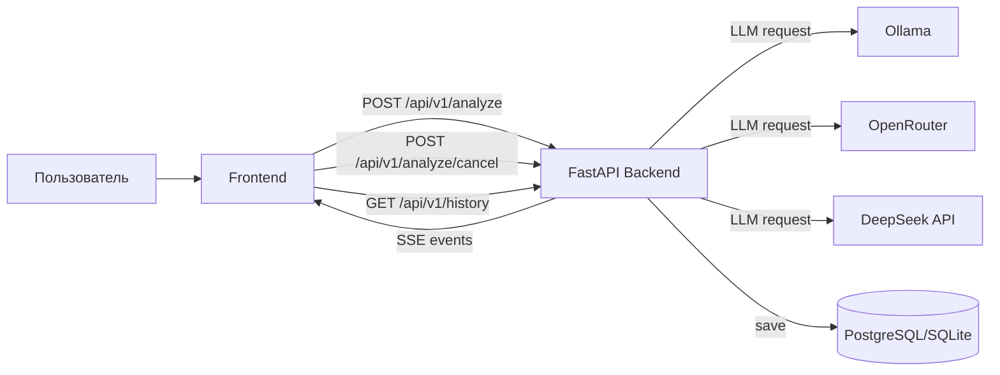
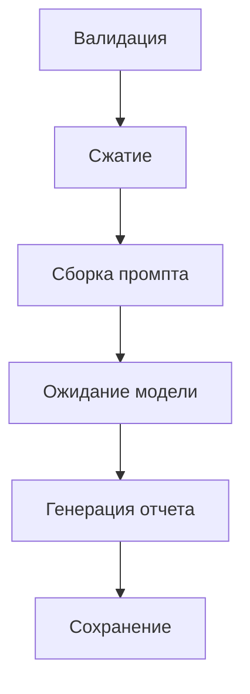

# ТЗ для презентации: AutoDocGen

Документ подготовлен как основа для презентации/защиты: показывает цель проекта, архитектуру, связи модулей, ход данных, контроль надежности и сценарий демонстрации.

---

## 1. Проблема и цель проекта

### Проблема
- Ручной технический анализ кода занимает много времени.
- В проекте смешаны backend/frontend/конфиги, сложно быстро собрать целостную картину.
- Без прозрачного логирования сложно объяснить, где и почему анализ ломается.

### Цель
- Автоматизировать генерацию Markdown-отчета "Технический анализ" по загруженным файлам.
- Показывать результат потоково (в реальном времени), а не только в конце.
- Обеспечить управляемость: прогресс, логи, отмена задач, история запусков.

---

## 2. Архитектура решения

### Компоненты
- **Frontend (`React + Vite`)**
  - авторизация,
  - загрузка файлов,
  - выбор провайдера/модели,
  - потоковое отображение Markdown,
  - progress и debug-консоль.
- **Backend (`FastAPI`)**
  - endpoint анализа,
  - интеграция с LLM-провайдерами,
  - бизнес-логика пайплайна,
  - отмена задач и логирование.
- **База данных (`SQLAlchemy`)**
  - `User`, `AnalysisRun`, `AnalysisFile`, `AnalysisResult`, `AnalysisReport`.

### Схема связей (для слайда)

---

## 3. Сквозной процесс анализа (Pipeline)

1. **Validation**
   - проверка количества файлов (`1..15`),
   - whitelist расширений.
2. **Read files**
   - все `UploadFile` читаются сразу и закрываются,
   - предотвращает ошибку `I/O operation on closed file`.
3. **Compression**
   - чистка и сжатие контента (комментарии, пустые строки, длинные блоки, JSON).
4. **Prompt Build**
   - сборка технического промпта по структуре отчета.
5. **Streaming Generation**
   - запрос к выбранному провайдеру,
   - потоковые SSE-чанки в UI.
6. **Persistence**
   - сохранение отчета и метаданных анализа в БД.

### Визуализация этапов

---

## 4. Провайдеры и режимы работы

### Поддерживаемые провайдеры
- `ollama` (локальный runtime),
- `openrouter`,
- `deepseek` (прямой API).

### Логика выбора
- Провайдер задается с фронта.
- Backend выбирает соответствующий клиент запроса.
- Для внешних провайдеров API key передается в запросе (не хранится в БД).

### Ускоренный локальный режим (`fast_local`)
- для Ollama:
  - уменьшение объема входного текста,
  - упрощенный prompt,
  - более быстрые параметры генерации,
  - отключение тяжелых режимов ради скорости.

---

## 5. Логирование, диагностика, прозрачность

### Каналы логирования
- `autodocgen.log` с ротацией (10MB, 3 backup),
- in-memory буфер логов,
- SSE `meta.analysis_log` для UI.

### Что логируется
- HTTP запросы (метод/путь/статус/время),
- этапы анализа (`ANALYSIS START`, `VALIDATION`, `COMPRESSION`, `PROMPT BUILD`, `CHUNK`, `DONE`, `FAILED`),
- провайдерские ошибки с деталями ответа,
- heartbeat при долгом ожидании.

### Польза для презентации
- Можно показать "почему не сработало" без догадок.
- Видно, где узкое место: валидация, провайдер, таймаут, лимит ключа.

---

## 6. Отмена задач и устойчивость

### Механизм
- Каждому запуску назначается `run_id`.
- Backend хранит связку `run_id -> asyncio.Task`.
- `POST /api/v1/analyze/cancel`:
  - ставит флаг отмены,
  - вызывает `task.cancel()` у активной задачи.

### Анти-зависание
- timeout на HTTP-запросы к провайдерам,
- timeout на первый чанк,
- фронтовый timeout на общий analyze-запрос.

---

## 7. UI и пользовательский сценарий

### UX-функции
- drag&drop загрузка,
- выбор провайдера и модели,
- потоковый Markdown preview,
- прогресс-бар этапов,
- debug-консоль (цвета `INFO/WARNING/ERROR`),
- кнопка отмены.

### Демо-сценарий (для защиты)
1. Войти в систему.
2. Загрузить 2-5 файлов.
3. Выбрать провайдера и запустить анализ.
4. Показать этапы и потоковое появление отчета.
5. Показать debug-консоль.
6. Сделать отмену посередине.
7. Открыть сохраненный отчет из истории.

---

## 8. Нефункциональные требования

- Надежность: ошибки должны быть объяснимыми и трассируемыми.
- Производительность: локальный режим должен работать без внешних лимитов.
- Прозрачность: все ключевые этапы должны быть видны в логах.
- Повторяемость: один и тот же вход дает сопоставимый структурный отчет.

---

## 9. Критерии готовности к презентации

- Логин/регистрация работают стабильно.
- Анализ запускается и стримится в UI.
- Отмена задач работает.
- История запусков сохраняется и открывается.
- При сбое провайдера пользователь видит понятную ошибку.
- На слайдах представлены:
  - архитектура,
  - pipeline,
  - схема связей,
  - live/demo-сценарий,
  - логирование и контроль ошибок.
